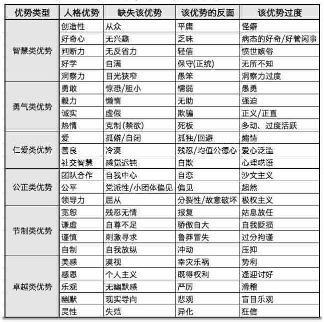

## 答疑启发

今天阳老答疑是说最小故事的事件不重要。最重要的是提炼出与人性相关的核心矛盾。再根据这个矛盾去生发故事的事件就容易了。

## 讨论前的任务：

 今天BP讨论很重要的结果是初步确立了故事的矛盾。  

 暂定的人性美德关键词是 :  
 - 正面：**“好奇心”(备选：感受、感知)**。  
 - 反面： **“乏味”（备选：麻木、淡漠）**

#### 请所有人（包括观察员哦）根据这对矛盾写出最小故事和作为隐喻的意向，线上开会时候讨论进行确定。

- 所有人都写的目的在于博采众长和统一思路。
- 请大家在会议前30分钟将，故事和意向提交到本issue.
- 其他的人性关键词和核心矛盾,如有好的想法也可以展开

## 灵感触发器

为什么想从**感受**作为核心词汇，大家可参考以下打动了我们的一段话

摘录《夏山学校》里的一段话：
>在师范学院或大学里给学生们讲课时，面对这些满腹无用知识的青年男女，我常对他们的幼稚感到惊讶，他们知道的很多，辩论对答如流，古文出口成章，但他们对人生的看法却幼稚如婴儿。**他们只被教会怎样了解，但未学到怎样感受**。这些学生很友善、和气与热情，却缺乏敏感性和用感性的知觉来引导思考的能力。**我给他们讲的是一个他们已经错过并再也回不去的世界**。

## 以人性矛盾写最小故事的思路

1. 可参考下图的模式，列出一个矛盾和两条主线。

     

  如：
  - 一个矛盾：好奇心VS乏味  /  感受力VS麻木
  - 两条主线：对事物的好奇才能激发自主探索的兴趣，强行灌输会更加乏味。

2. 按照英雄之旅的构架，添加事件，组合成最小故事

  

   按照英雄之旅的模型把 陪孩子读诗还原了一下。

   **可以仿照此结构写下你的最小故事**

   * [《陪孩子读诗》故事结构借鉴](https://github.com/gabriel-guobin/ChildAcademy/blob/master/AccompanyChildToReadPoetry.md)
