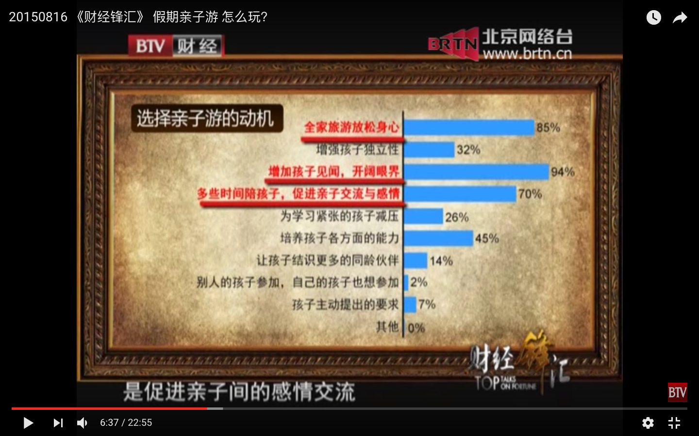
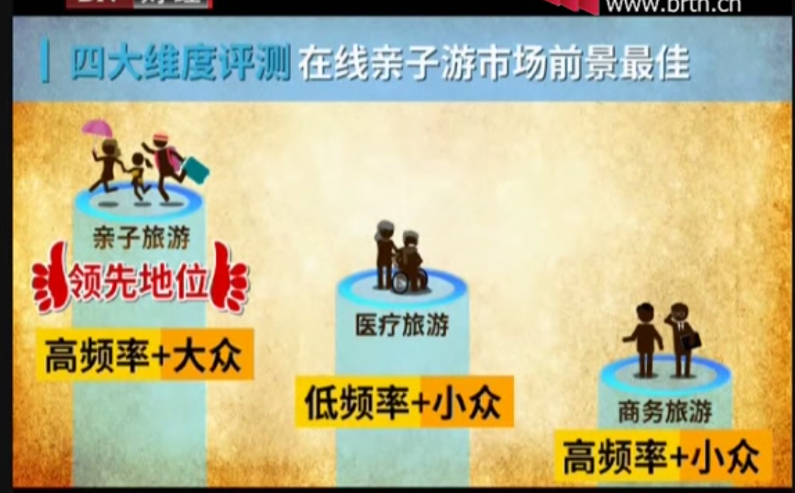
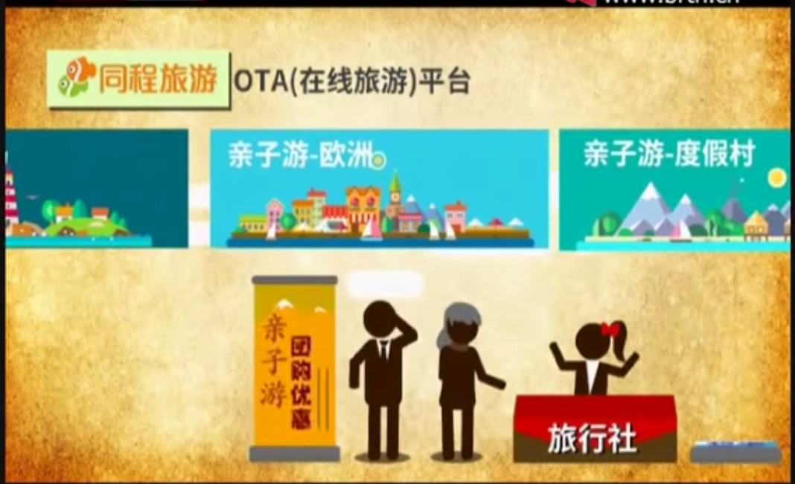
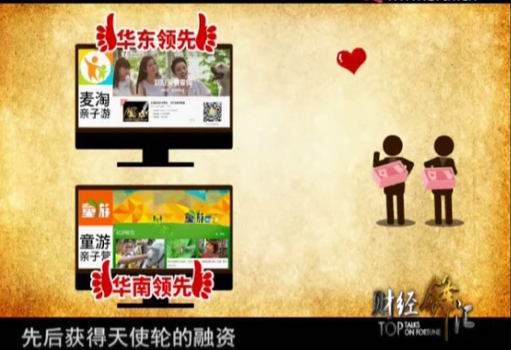

## 家长对亲子游的需求分析

1. 旅游过程中的特色教育
2. 孩子们玩得开心
3. 行程设计舒适合理
4. 目的地安全
5. 孩子对目的地的兴趣
6. 孩子能在目的地结交同伴（由于是独生子女）
7. 相对而言，省钱是最次要的需求

### 调查：选择亲子游的动机
1. **增加孩子见闻，开阔眼界 94%**
2. **全家旅游放松身心  85%**
3. **多些时间陪孩子，促进亲子交流与感情。  70%**
4. 培养孩子各方面的能力 45%
5. 增强孩子独立性 32%
6. 为学习紧张的孩子减压 26 %
7. 让孩子解释更多的同龄伙伴 14%



## 家长的痛点

1. 头疼带孩子去哪里？
2. 景点不适合孩子玩
3. 不要让亲子游变成陪孩子游（父母的作用）
4. 不想走马观花的看看就会，想增加一些有特色有意义的环节。

##  亲子游消费特点
一定程度上受到爸爸去哪等节目的影响，出行的目的非常明确。具备以下两个特点：

- 清晰地目标定位
- 强有力的消费能力



##  主要平台



